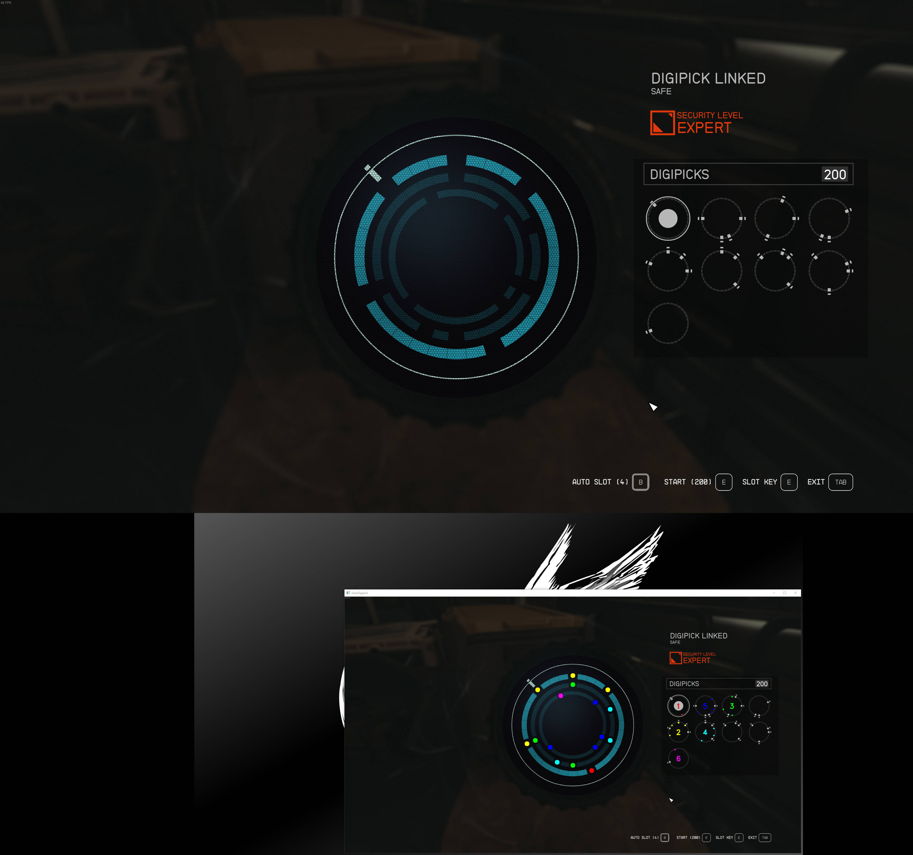

# AutoDigipick

Digipick puzzles in Bethesda's Starfield are fun to solve, but they can be tedious to solve manually. This script automates the process of solving them.

Using OpenCV and Tesseract, the script takes a screenshot of the puzzle, identifies the symbols, and solves the puzzle. It then displays the solution in an extra window which you can display on a second monitor for quick reference.




# Installation

You will need to install [Tesseract](https://tesseract-ocr.github.io/tessdoc/Installation.html) and add the path to the tesseract executable to your PATH environment variable.

If you use the packed executable release of AutoDigipick, then you can start it by double-clicking the executable. 

Otherwise, you will need to install [Python](https://www.python.org/downloads/) and install the dependencies listed in requirements.txt. Then you can run the script with `python autodigipick.py`.

Alternatively, you can install the package with pip (Recommended in a virtual environment or using tools like pipx):

```cmd
pip install autodigipick
```

and use `autodigipick.exe` to run the script. The configuration file will be created in the active directory and you can modify it to your needs.


## Usage

Open autodigipick.toml in a text editor and change the configuration to fit your personal setup.

In particular, you will need to change the following values:

```toml
[capture]
monitor_id = 3  # Change to your monitor's ID
```

```toml
[hotkey]
solve = "F13"  # I use macro keys on my keyboard, but you can use any key you want
exit = "F14"  # it also supports combinations with + like "ctrl+shift+alt+q"
```

```toml
[display]
resolution = [1920, 1080]  # Depending on the size of your secondary monitor, you may need to change this
position = [1000, 2300]  # Change this to a position on your secondary monitor
```

Then just run the script and press the solve hotkey while the puzzle is on screen.
